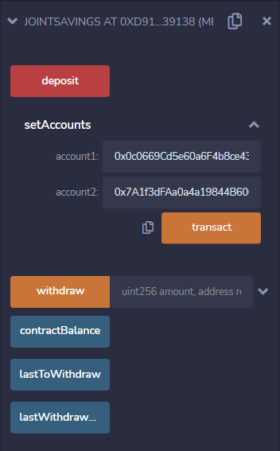

# Joint Savings Account
This Solidity smart contract hosts joint savings accounts using ether management functions that provide the features of the accounts. More specifically, it accepts two account addresses that are able to control the joint savings account by depositing or withdrawing funds from the account.

## Technologies
The technology required to use this project is the Remix IDE, which is a local blockchain development environment that provides a JavaScript VM. 

## Examples
Upon deploying the smart contract, the users are presented with three functions: deposit, setAccounts, and withdraw. In addition to the functions, there are three buttons for displaying contract variables: contractBalance, lastToWithdraw, and lastWithdrawalAmount. Following are explanations for how the functions work, and screenshots of examples that were used to test their functionality.

**Set Accounts:**

The "setAccounts" function allows the user to enter two account addresses: "account1" and "account2". Once two valid addresses are entered, and the user clicks the "transact" button, the addresses are set as the only addresses that can withdraw from the joint savings account contract. 

The following screenshot shows the terminal details of successfully executing the "setAccounts" function.

**Deposit:**

The "deposit" function allows the user to deposit ether into the contract by entering an amount in an ether denomination, into the "VALUE" textbox of the Remix IDE's "Deploy and Run" module, and clicking the "deposit" button. The following screenshot shows the terminal execution results of depositing 5 ether (5000000000000000000 wei).

To confirm that the amount was deposited into the contract, the user can click the "contractBalance" button to display the contract's updated balance in wei, as is shown below.

**Withdraw:**

The "withdraw" function allows the user to withdraw funds into one of the joint account addresses (account1 or account2) that were set in the "setAccounts" function. The user can enter the funds (in wei) into the "amount" textbox, and the account address into the "recipient" textbox. The following screenshot shows the terminal execution results of withdrawing 5 ether as wei (5000000000000000000 wei) into account1.

To verify that the funds were withdrawn from the contract, the user can click the "contractBalance" button to display the contract's updated balance in wei, as is shown below.

Furthermore, to confirm that the address and amount withdrawn from the contract were correct, the user can click the "lastToWithdraw" and "lastWithdrawAmount" buttons, as can be seen in the following screenshots.

## Contributors

Contributed by: Gregg R. Saldutti

Email: greggnyc1@gmail.com

[ LinkedIn](https://www.linkedin.com/in/greggsaldutti-1701501)

---

## License

## Copyright © 2022 #Joint-Savings-Account

Permission is hereby granted, free of charge, to any person obtaining a copy
of this software and associated documentation files (the "Software"), to deal
in the Software without restriction, including without limitation the rights
to use, copy, modify, merge, publish, distribute, sublicense, and/or sell
copies of the Software, and to permit persons to whom the Software is
furnished to do so, subject to the following conditions:

The above copyright notice and this permission notice shall be included in all
copies or substantial portions of the Software.

THE SOFTWARE IS PROVIDED "AS IS", WITHOUT WARRANTY OF ANY KIND, EXPRESS OR
IMPLIED, INCLUDING BUT NOT LIMITED TO THE WARRANTIES OF MERCHANTABILITY,
FITNESS FOR A PARTICULAR PURPOSE AND NONINFRINGEMENT. IN NO EVENT SHALL THE
AUTHORS OR COPYRIGHT HOLDERS BE LIABLE FOR ANY CLAIM, DAMAGES OR OTHER
LIABILITY, WHETHER IN AN ACTION OF CONTRACT, TORT OR OTHERWISE, ARISING FROM,
OUT OF OR IN CONNECTION WITH THE SOFTWARE OR THE USE OR OTHER DEALINGS IN THE
SOFTWARE.
